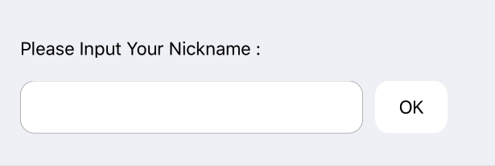
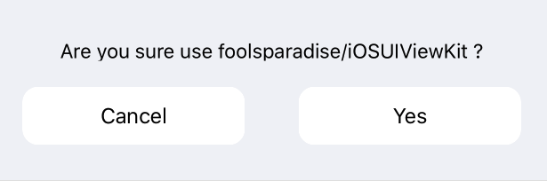
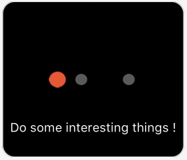
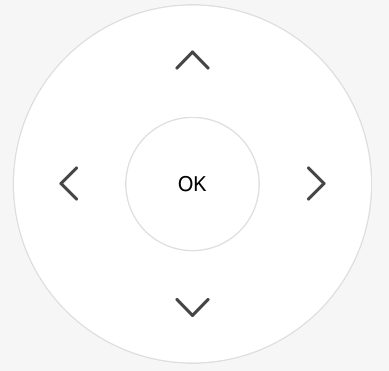
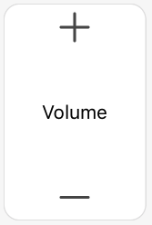
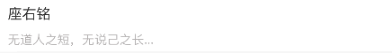

# FoolsparadiseView  
原 Repository name 是 foolsparadise/iOSUIViewKit ，现更新为 foolsparadise/FoolsparadiseView  

## Before Use , Preparation  
- [Masonry](https://github.com/SnapKit/Masonry) or [i forked Masonry](https://github.com/foolsparadise/Masonry). Donnot worry, its same one.  
  

## Howto  
import FoolsparadiseView.h and use...  

#### AlertWith1inputTextFieldView preview  
  
#### Usage  
```  
#import "AlertWith1inputTextFieldView.h"  
  
<AlertWith1inputTextFieldViewDelegate>  
  
AlertWith1inputTextFieldView *centerAlertInputView ;  
centerAlertInputView = [[AlertWith1inputTextFieldView alloc] initWithFrame:CGRectMake(0, 100, [UIScreen mainScreen].bounds.size.width, 140)];  
centerAlertInputView.titleAlertString = NSLocalizedStringFromTable(@"Please Input Your Nickname:", @"InfoPlist", nil);  
centerAlertInputView.leftShowString = NSLocalizedStringFromTable(@"Your Nickname", @"InfoPlist", nil);  
centerAlertInputView.rightButtonString = NSLocalizedStringFromTable(@"OK", @"InfoPlist", nil);  
centerAlertInputView.delegate = self;  
centerAlertInputView.tag = tag;  
[self.view addSubview:centerAlertInputView];  
[centerAlertInputView mas_makeConstraints:^(MASConstraintMaker *make) {  
    make.top.mas_equalTo(self.view.mas_top).mas_offset(100);  
    make.left.mas_equalTo(self.view.mas_left).mas_offset(0);  
    make.size.mas_equalTo(CGSizeMake(SCREEN_WIDTH, 140));  
}];  
  
//Delegate  
- (void)AlertWith1inputTextFieldViewDelegate:(NSInteger)ClickedTag withInputString:(NSString *)InputString  
{  
    NSLog(@"%s click %ld %@", __func__, (long)ClickedTag, InputString);  
    if(InputString.length<=0) {  
        //No Input  
        return;  
    }  
    if(centerAlertInputView) {
      [centerAlertInputView removeFromSuperview];
      centerAlertInputView=nil;
    }
    __weak typeof(self) weakSelf = self;  
    // ClickedTag view' tag  
    if(ClickedTag==1) { }  
}  
```      
  
#### AlertWith2ButtonView preview  
  
#### Usage  
```  
#import "AlertWith2ButtonView.h"  
  
<AlertWith2ButtonViewDelegate>  
  
AlertWith2ButtonView *centerAlertView;  
centerAlertView = [[AlertWith2ButtonView alloc] initWithFrame:CGRectMake(0, 100, [UIScreen mainScreen].bounds.size.width, 140)];      
centerAlertView.titleAlertString = NSLocalizedStringFromTable(@"Are you sure use foolsparadise/FoolsparadiseView ?", @"InfoPlist", nil);  
centerAlertView.leftButtonString = NSLocalizedStringFromTable(@"NO", @"InfoPlist", nil);  
centerAlertView.rightButtonString = NSLocalizedStringFromTable(@"Yes", @"InfoPlist", nil);  
centerAlertView.delegate = self;  
centerAlertView.tag = tag;  
[self.view addSubview:centerAlertView];  
[centerAlertView mas_makeConstraints:^(MASConstraintMaker *make) {  
    make.top.mas_equalTo(self.view.mas_top).mas_offset(100);  
    make.left.mas_equalTo(self.view.mas_left).mas_offset(0);  
    make.size.mas_equalTo(CGSizeMake(SCREEN_WIDTH, 140));  
}];  
  
//Delegate    
- (void)AlertWith2ButtonViewDelegate:(NSInteger)ClickedTag withButtonTag:(NSInteger)ButtonTag  
{  
    NSLog(@"%s click %ld %ld", __func__, (long)ClickedTag, (long)ButtonTag);  
    __weak typeof(self) weakSelf = self;  
    // ClickedTag view' tag  
    if(centerAlertView) {
      [centerAlertView removeFromSuperview];
      centerAlertView=nil;
    }
    // ButtonTag 1:left 2:right  
    if(ClickedTag==1) {  
        if(ButtonTag==1) { }  
        else { }  
    }  
}  
```  
  
#### AnimationLoadingView preview  
  
#### Usage  
```  
#import "AnimationLoadingView.h"  
  
AnimationLoadingView *centerAnimationView;  
  
centerAnimationView = [[AnimationLoadingView alloc] initWithFrame:CGRectMake(0, 0, 174, 150)];  
centerAnimationView.msgShowString = @"Do some interesting things !";  
[weakSelf.view addSubview:centerAnimationView];  
[centerAnimationView mas_makeConstraints:^(MASConstraintMaker *make) {  
    make.centerX.mas_equalTo(weakSelf.view.mas_centerX).mas_offset(0);  
    make.centerY.mas_equalTo(weakSelf.view.mas_centerY).mas_offset(0);  
    make.size.mas_equalTo(CGSizeMake(174, 150));  
}];  

```  
  
#### Round5WithMultiGestureView preview  
   
#### Usage    
```  
#import "Round5WithMultiGestureView.h"  
  
<Round5WithMultiGestureViewDelegate>  
  
@property (nonatomic, strong) Round5WithMultiGestureView * Round5Button;  
  
[self.view addSubview:self.Round5Button];  
[self.Round5Button mas_makeConstraints:^(MASConstraintMaker *make) {  
    make.top.mas_equalTo(self.view.top).mas_offset(348.5);  
    make.size.mas_equalTo(CGSizeMake(240, 240));  
    make.centerX.mas_equalTo(self.view.mas_centerX).mas_offset(0);  
}];  
  
-(Round5WithMultiGestureView *)Round5Button  
{  
    if (!_Round5Button) {  
        _Round5Button = [[Round5WithMultiGestureView alloc] initWithFrame:CGRectMake(67.5, 348.5, 240, 240)];  
        _Round5Button.upImageViewString = @"MultiGestureView_top";  
        _Round5Button.leftImageViewString = @"MultiGestureView_left";  
        _Round5Button.middleLableString = @"OK";  
        _Round5Button.rightImageViewString = @"MultiGestureView_right";  
        _Round5Button.downImageViewString = @"MultiGestureView_bottom";  
        _Round5Button.delegate = self;  
        _Round5Button.tag = 1;  
    }  
    return _Round5Button;  
}  
- (void)Round5WithMultiGestureViewDelegate:(NSInteger)ClickedTag withButtonTag:(NSInteger)ButtonTag  
{  
    NSLog(@"%s click %ld %ld", __func__, (long)ClickedTag, (long)ButtonTag);  
    // ClickedTag : view tag
    // ButtonTag 0:centel OK btn 1:top 2:left 3:right 4:bottom 
}  
```  
#### Square3WithMultiGestureView preview  
  
#### Usage    
```  
#import "Square3WithMultiGestureView.h"  
  
<Square3WithMultiGestureViewDelegate>  
  
@property (nonatomic, strong) Square3WithMultiGestureView * Square3Button;  
  
[self.view addSubview:self.Square3Button];  
[self.Square3Button mas_makeConstraints:^(MASConstraintMaker *make) {  
    make.top.mas_equalTo(self.view.top).mas_offset(165);  
    make.size.mas_equalTo(CGSizeMake(105, 160));  
    make.centerX.mas_equalTo(self.view.mas_centerX).mas_offset(-105-20);  
}];  

-(Square3WithMultiGestureView *)Square3Button  
{  
    if (!_Square3Button) {  
        _Square3Button = [[Square3WithMultiGestureView alloc] initWithFrame:CGRectMake(10, 165, 105, 160)];  
        _Square3Button.upImageViewString = @"MultiGestureView_plus";  
        _Square3Button.middleLableString = @"Volume";  
        _Square3Button.downImageViewString = @"MultiGestureView_minus";  
        _Square3Button.delegate = self;  
        _Square3Button.tag = 1;  
    }  
    return _Square3Button;  
}  
- (void)Square3WithMultiGestureViewDelegate:(NSInteger)ClickedTag withButtonTag:(NSInteger)ButtonTag  
{  
    NSLog(@"%s click %ld %ld", __func__, (long)ClickedTag, (long)ButtonTag);  
    // ClickedTag : view tag  
    // ButtonTag 1:top 2:bottom  
}  
```  
  
## Round5WithMultiGestureView and Square3WithMultiGestureView 3rd  
```  
/**  
 #超出响应区域无法响应相关的事件  
 对于iOS的点击事件来说如果点击的区域超出了其本身的视图大小和其父视图的大小，是不会响应这个点击事件的，这个特性对于UIControl, UIButton, UITapGestureRecognizer, UILongPressGestureRecognizer, UISwipeGestureRecognizer等响应点击事件的控件或手势来说是很重要的，只要控件或手势超出了其本身的大小和其父视图的大小，那就不会响应点击事件。  
   
 #超出响应区域仍能继续响应相关的事件  
 但是对于滑动手势如:UIPanGestureRecognizer, UIRotationGestureRecognizer, UIPinchGestureRecognizer手势来说超出其本身大小和其父视图的大小后仍能响应滑动事件。  
 */  
  
- (void)viewDidLoad {  
    [super viewDidLoad];  
      
    UIView *panGestureView = [UIView new];  
    panGestureView.backgroundColor = [UIColor cyanColor];  
    [self.view addSubview:panGestureView];  
    CGRect frame = (CGRect){100, 100, 200, 200};  
    panGestureView.frame = frame;  
      
    //UITapGestureRecognizer //点击  
    //UILongPressGestureRecognizer //长按  
    //UISwipeGestureRecognizer  
    //UIPanGestureRecognizer //滑动  
    //UIRotationGestureRecognizer  
    //UIPinchGestureRecognizer  
      
    UIPanGestureRecognizer *panGesture = [[UIPanGestureRecognizer alloc] initWithTarget:self action:@selector(panGesture:)];  
    [panGestureView addGestureRecognizer:panGesture];  
}  
  
- (void)panGesture:(UIGestureRecognizer *)gesture{  
      
    CGPoint point = [gesture locationInView:gesture.view];  
    NSLog(@"point is %@", NSStringFromCGPoint(point));  
}  
  
```    
#### TopImage_BottomTitleLabel_ContentCenter_Button preview  

#### Usage  
```
__weak typeof(self) weakSelf = self;
TopImage_BottomTitleLabel_ContentCenter_Button *btn = [TopImage_BottomTitleLabel_ContentCenter_Button new];
btn.tag=0;
[btn addTarget:self action:@selector(ClickedRecord) forControlEvents:UIControlEventTouchUpInside];
[self.view addSubview:btn];
[btn mas_makeConstraints:^(MASConstraintMaker *make) {
    make.bottom.mas_equalTo(weakSelf.view.mas_bottom).mas_offset(0);
    make.centerX.mas_equalTo(weakSelf.view.mas_centerX).mas_offset(0);
    //make.size.mas_equalTo(CGSizeMake(68, 68));
    make.size.mas_equalTo(CGSizeMake(120, 120));
}];
[btn configureheightSpace:26 withTitle:@"请开始你的表演" withImageNamed:@"top_image_name"];
```
#### ImageAndTitleLabelTableViewCell preview

#### Usage
```
- (CGFloat)tableView:(UITableView *)tableView heightForRowAtIndexPath:(NSIndexPath *)indexPath{
    return 56;
}
- (UITableViewCell*)tableView:(UITableView *)tableView cellForRowAtIndexPath:(NSIndexPath *)indexPath{
    NSString *cellId = @"CellId";
    ImageAndTitleLabelTableViewCell *cell = [tableView dequeueReusableCellWithIdentifier:cellId];
    if (cell == nil) {
        cell = [[ImageAndTitleLabelTableViewCell alloc] initWithStyle:UITableViewCellStyleDefault reuseIdentifier:cellId] ;
    }
    cell.preservesSuperviewLayoutMargins = false;
    cell.separatorInset = UIEdgeInsetsZero;
    cell.layoutMargins = UIEdgeInsetsZero;
    [cell configWithTitle:@"yourtitletext" withTitleImageName:@"youttitleicon"];
    cell.selectedBackgroundView = [[UIView alloc] init];
    cell.selectedBackgroundView.backgroundColor = [UIColor selectCellColor];
    return cell;

}
UITableViewCell 与周围View保持一点点距离
//15为距离，这里加个距离
- (CGFloat)tableView:(UITableView *)tableView heightForRowAtIndexPath:(NSIndexPath *)indexPath{
    return 120+15;
}
自定义cell中添加如下代码
- (void)setFrame:(CGRect)frame{
    frame.origin.x += 15;
    frame.origin.y += 15;
    frame.size.height -= 15;
    frame.size.width -= 30;
    [super setFrame:frame];
}
```
#### TitleLabelTopAndBottomTableViewCell preview

#### Usage
```
- (CGFloat)tableView:(UITableView *)tableView heightForRowAtIndexPath:(NSIndexPath *)indexPath{
    return 56;
}
- (UITableViewCell*)tableView:(UITableView *)tableView cellForRowAtIndexPath:(NSIndexPath *)indexPath{
    NSString *cellId = @"CellId";
    TitleLabelTopAndBottomTableViewCell  *cell = [tableView dequeueReusableCellWithIdentifier:cellId];
    if (!cell)
        cell = [[TitleLabelTopAndBottomTableViewCell alloc] initWithStyle:UITableViewCellStyleSubtitle reuseIdentifier:cellId];
    [cell configWithTitle:@"yourtitletext" withSubTitle:@"yoursubtitletext"];
    cell.selectedBackgroundView = [[UIView alloc] init];
    cell.selectedBackgroundView.backgroundColor = [UIColor selectCellColor];
    return cell;

}
UITableViewCell 与周围View保持一点点距离
//15为距离，这里加个距离
- (CGFloat)tableView:(UITableView *)tableView heightForRowAtIndexPath:(NSIndexPath *)indexPath{
    return 120+15;
}
自定义cell中添加如下代码
- (void)setFrame:(CGRect)frame{
    frame.origin.x += 15;
    frame.origin.y += 15;
    frame.size.height -= 15;
    frame.size.width -= 30;
    [super setFrame:frame];
}
```  
#### DelegateDemoView .h.m Demo for Delegate 使用回调  
```  
//DelegateDemoView.h
#import <UIKit/UIKit.h>

@protocol DelegateDemoViewDelegate <NSObject>

@optional
- (void)DelegateDemoViewDelegate:(BOOL)isOK withViewTag:(NSInteger)ViewTag;

@end

@interface DelegateDemoView : UIView

@property (nonatomic, weak) id <DelegateDemoViewDelegate> delegate;

@end
```  
```  
//DelegateDemoView.m
#import "DelegateDemoView.h"
@interface DelegateDemoView ()
@end
@implementation DelegateDemoView
/*
 // Only override drawRect: if you perform custom drawing.
 // An empty implementation adversely affects performance during animation.
 - (void)drawRect:(CGRect)rect {
 // Drawing code
 }
 */
- (instancetype)initWithFrame:(CGRect)frame
{
    self = [super initWithFrame:frame];
    if (self) {
        [self setupUI];
    }
    return self;
}
- (void)setupUI {  
    //[self.delegate DelegateDemoViewDelegate:YES withViewTag:self.tag];
    
}
@end
```  
#### Block demo 使用block包  
```  
+ (void)getBlock:(void (^)(bool isOK ,NSArray<NSDictionary *> *resultArray))callback
{
    __block NSArray *getArray = nil;
    dispatch_semaphore_t semaphore_getList = dispatch_semaphore_create(0);
    dispatch_queue_t queue_getList  = dispatch_queue_create("semaphore_getList", NULL);
    dispatch_async(queue_getList , ^(void) {
        NSString *str = [NSString stringWithFormat:@"http://www.example.com/getList.html"];
        NSURL *url = [NSURL URLWithString:str];
        NSURLSessionConfiguration *configuration = [NSURLSessionConfiguration defaultSessionConfiguration];
        NSURLSession *session = [NSURLSession sessionWithConfiguration:configuration];
        [[session dataTaskWithURL:url
                completionHandler:^(NSData *data, NSURLResponse *response, NSError *error)
          {
              if (error) {
                  NSLog(@"0(%@)", error.description);
              }
              else {
                  NSString *responseString = [[NSString alloc] initWithData:data  encoding:NSUTF8StringEncoding];
                  //responseString = [DelegateDemoView replaceUnicode:responseString];
                  NSLog(@"1(%@)", responseString);
                  NSDictionary *string2Dic = [NSJSONSerialization JSONObjectWithData: [responseString dataUsingEncoding:NSUTF8StringEncoding]
                                                                             options: NSJSONReadingMutableContainers
                                                                               error: &error];
                  // json like {"code":0,"count":0,"data":[{"id":"176"}]}
                  NSString *tmp = [NSString stringWithFormat:@"%@",[string2Dic valueForKey:@"code"]];
                  if ([tmp isEqualToString:@"0"]) {
                      NSArray *getdataArr = [string2Dic valueForKey:@"data"];
                      NSMutableArray *arr = [[NSMutableArray alloc] initWithCapacity:99];
                      for (NSDictionary *Obj in getdataArr) {
                          [arr addObject:Obj];
                          NSLog(@"2(%@)", Obj);
                      }
                      getArray = [arr copy];
                  }
              }
              dispatch_semaphore_signal(semaphore_getList);
              
          }] resume];
    });
    dispatch_semaphore_wait(semaphore_getList,DISPATCH_TIME_FOREVER);
    if (callback) {
        if(getArray.count==0)
            callback(NO, getArray);
        else
            callback(YES, getArray);
    }
}
```  
#### UIImageView+Foolsparadise .h.m Category demo imageWithNamed取bundle文件中图片   
```  
//UIImageView+Foolsparadise.h
#import <UIKit/UIKit.h>

@interface UIImageView (Foolsparadise)

+ (UIImage *)imageWithNamed:(NSString *)imageName;

@end
```  
```  
//UIImageView+Foolsparadise.m
#import "UIImageView+Foolsparadise.h"

@implementation UIImageView (Foolsparadise)

+ (UIImage *)imageWithNamed:(NSString *)imageName
{
    UIImage *image;
    NSString *bundleName;
    bundleName = @"FoolsparadiseView";
    NSString *path = [[NSBundle mainBundle] pathForResource:bundleName ofType:@"bundle"];
    path = [path stringByAppendingPathComponent:imageName];
    image = [UIImage imageWithContentsOfFile:path];
    return image;
}

@end
```  
#### Multi Lines UILabel demo 多行显示的UILabel  
```  
usage:  
@property (nonatomic, strong) UILabel *MultiLinesUILabel;  
[self.view addSubview:self.MultiLinesUILabel];  
[self.MultiLinesUILabel mas_makeConstraints:^(MASConstraintMaker *make) {  
    make.left.mas_equalTo(self.view.mas_left).mas_offset(10);  
    make.right.mas_equalTo(self.view.mas_right).mas_offset(-10);  
    make.top.mas_equalTo(self.view.mas_top).mas_offset(10);  
    make.height.mas_equalTo(300);  
}];  
```  
```  
code:  
- (UILabel *)MultiLinesUILabel  
{  
    if (!_MultiLinesUILabel) {  
        #define vSCREEN_WIDTH ([UIScreen mainScreen].bounds.size.width)  
        #define vFONT(fontSize) [UIFont fontWithName:@"STHeitiSC-Medium" size:(fontSize)]  
        #define vRGBCOLOR(r,g,b) [UIColor colorWithRed:(r)/255.0 green:(g)/255.0 blue:(b)/255.0 alpha:1]  
        //UIView *Labeliew = [[UIView alloc] initWithFrame:CGRectMake(10, 10, vSCREEN_WIDTH-20, 300)];  
        UILabel *titleLable = [[UILabel alloc] initWithFrame:CGRectMake(10, 10, vSCREEN_WIDTH-20, 300)];         
        NSMutableParagraphStyle *paraStyle = [[NSMutableParagraphStyle alloc] init];  
        paraStyle.lineBreakMode = NSLineBreakByWordWrapping;  
        paraStyle.alignment = NSTextAlignmentCenter;  
        paraStyle.lineSpacing = 6; //设置行间距  
        paraStyle.hyphenationFactor = 1.0;  
        paraStyle.firstLineHeadIndent = 0.0;  
        paraStyle.paragraphSpacingBefore = 0.0;  
        paraStyle.headIndent = 0;  
        paraStyle.tailIndent = 0;  
        //设置字间距 NSKernAttributeName:@1.5f  
        NSDictionary *dic = @{NSParagraphStyleAttributeName:paraStyle};  
        NSMutableAttributedString *attributeStr = [[NSMutableAttributedString alloc] initWithString:@"MIT Copyright , Writed by github.com/foolsparadise" attributes:dic];  
        NSRange range = [attributeStr.string rangeOfString:@"Alert:"];  
        [attributeStr addAttribute:NSFontAttributeName value:vFONT(16) range:NSMakeRange(range.location, range.length)];  
        [attributeStr addAttribute:NSForegroundColorAttributeName value:vRGBCOLOR(230, 99 ,60) range:NSMakeRange(range.location, range.length)];  
        
        [attributeStr addAttribute:NSFontAttributeName value:vFONT(13) range:NSMakeRange(range.length,attributeStr.length - range.length)];  
        [attributeStr addAttribute:NSForegroundColorAttributeName value:vRGBCOLOR(137, 142 ,149) range:NSMakeRange(range.length,attributeStr.length - range.length)];          
        titleLable.attributedText = attributeStr;          
        titleLable.textAlignment = NSTextAlignmentCenter; //字样的对齐位置  
        titleLable.numberOfLines = 0;  
        _MultiLinesUILabel = titleLable;  
    }  
    return _MultiLinesUILabel;  
}  
```  
#### Block Demo 嵌套，迭代，递归  
```  
//usage  
dispatch_async(dispatch_get_global_queue(DISPATCH_QUEUE_PRIORITY_BACKGROUND, 0),  
^{  
//后台运行，避免卡当前ViewController  
   __weak typeof(self)weakSelf = self;  
   [weakSelf Block1Demo:@"1" callback:^(int result) {  
       NSLog(@"%d", result);  
       //if(result==BlockDemoResult0) ...  
       //else ...  
       [weakSelf Block2Demo:@"2" callback:^(int result) {  
       //Block2Demo是类似于Block1Demo这样的函数  
           NSLog(@"%d", result);  
           if(result == BlockDemoResult0) {  
               dispatch_async(dispatch_get_main_queue(), ^{  
                   //do something for UI  
               });  
           }  
           //else if ...  
       }];  
   }];  
});  
```  
```  
//enum  
typedef enum{  
    BlockDemoResult0 = 0,  
    BlockDemoResult1,  
    BlockDemoResult2  
}BlockDemoResult;  
//function  
- (void)Block1Demo:(NSString *)randstr callback:(void (^)(int ret))callback  
{  
    __weak typeof(self) weakSelf = self;  
    if(0) {  
        if (callback) { callback(-1); } return;  
    }  
    NSString *saveUrl = [NSString stringWithFormat:@"http://www.example.com"];  
    AFHTTPSessionManager *manager = [AFHTTPSessionManager manager];  
    [manager GET:saveUrl parameters:nil progress:nil success:^(NSURLSessionDataTask * _Nonnull task, id  _Nullable responseObject) {  
        NSError *err2;  
        //json  
        NSDictionary *jsonDic = responseObject;//[NSJSONSerialization JSONObjectWithData: [responseObject dataUsingEncoding:NSUTF8StringEncoding] options: NSJSONReadingMutableContainers error: &err2];  
        if (err2 != nil) {  
            if (callback) { callback(-1); } return;  
        }  
        NSString *tmp1 = [NSString stringWithFormat:@"%@",[jsonDic valueForKey:@"code"]];  
        if ([tmp1 isEqualToString:@"0"]) //0正常  
        { NSLog(@"%@", tmp1); }  
        if (callback) { callback(0); }  
    } failure:^(NSURLSessionDataTask * _Nullable task, NSError * _Nonnull error) {  
        if (callback) { callback(-1); }  
    }];  
}  
```  
  
#### 通过UIImage*图片的NSData数据第一个字节，来获取图片扩展名(参考from SDWebImage)  
```  
- (NSString *)ImageFormatTypeForImageData:(NSData *)data  
{  
    if(!data) return nil;  
    uint8_t c;  
    [data getBytes:&c length:1];  
    switch (c) {  
        case 0xFF:  
            return @"jpeg";  
        case 0x89:  
            return @"png";  
        case 0x47:  
            return @"gif";  
        case 0x49:  
        case 0x4D:  
            return @"tiff";  
        case 0x52:  
            if ([data length] < 12)  
            {  
                return nil;  
            }  
            if (data.length >= 12) {  
                //RIFF....WEBP  
                NSString *testString = [[NSString alloc] initWithData:[data subdataWithRange:NSMakeRange(0, 12)] encoding:NSASCIIStringEncoding];  
                if ([testString hasPrefix:@"RIFF"] && [testString hasSuffix:@"WEBP"])  
                {  
                    return @"webp";  
                }  
            }  
            return nil;  
        case 0x00:  
            if ([data length] < 12)  
            {  
                return nil;  
            }  
            if (data.length >= 12) {  
                //....ftypheic ....ftypheix ....ftyphevc ....ftyphevx  
                NSString *testString = [[NSString alloc] initWithData:[data subdataWithRange:NSMakeRange(4, 8)] encoding:NSASCIIStringEncoding];  
                if ([testString isEqualToString:@"ftypheic"]  
                    || [testString isEqualToString:@"ftypheix"]  
                    || [testString isEqualToString:@"ftyphevc"]  
                    || [testString isEqualToString:@"ftyphevx"]) {  
                    return @"heic";  
                }  
            }  
            return nil;  
    }  
    return nil;  
}  
```  
  
#### 锁屏时，显示当前音乐的播放状态    
```  
dispatch_async(dispatch_get_main_queue(), ^{  
                    NSMutableDictionary *playInfoDict = [NSMutableDictionary new];  
                    UIImage *imageFromUrl = [UIImage imageNamed:@"play_musicpage"];  
                    [playInfoDict setObject:[playInfo SongName] forKey:MPMediaItemPropertyTitle];  
                    [playInfoDict setObject:[playInfo SingerName] forKey:MPMediaItemPropertyArtist];  
                    [playInfoDict setObject:[NSNumber numberWithInt:(int)[playInfo.duration longTimeValue]] forKey:MPMediaItemPropertyPlaybackDuration];  
                    [playInfoDict setObject:[NSNumber numberWithInt:(int)[playInfo.progress longTimeValue]] forKey:MPNowPlayingInfoPropertyElapsedPlaybackTime];  
                    MPMediaItemArtwork *mArt = [[MPMediaItemArtwork alloc] initWithImage:imageFromUrl];  
                    [playInfoDict setObject:mArt forKey:MPMediaItemPropertyArtwork];  
                    [[MPNowPlayingInfoCenter defaultCenter] setNowPlayingInfo:playInfoDict];  
                });  
```  
## ToDo:精简代码  

## MIT  
  

  
